# 600086 Final Lab - Matthew Panks

## GPU Design

The kernel is split into sections to perform particle updates, collision detection, and collision handling separately, with `cudaDeviceSynchronize` used inbetween to ensure full completion of the previous section before continuing.

Global memory is used as this is accessible by all threads in all blocks without need to allocate and manage shared memory. These are allocated once on startup and de-allocated on exit.

### Update

As each thread is concerned with a single particle, locks are not required to prevent race conditions. Each thread performs acceleration, position updates, cooling, and checks if the particle collides with the walls or floor.

Particles which collide with the floor are instantly respawned to remove an additional kernel launch. Wall collisions are elastic.

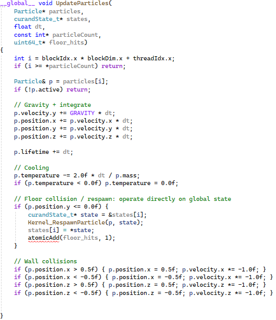

### Spatial Collision Grid

Collision detection is performed via a spatial grid, where particles in a cell are considered against the other particles in the same cell and those surrounding it.

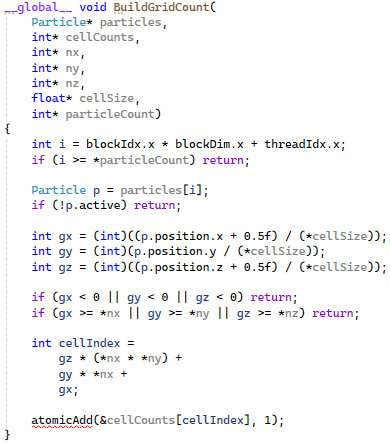

This simply builds the grid, which is then populated.

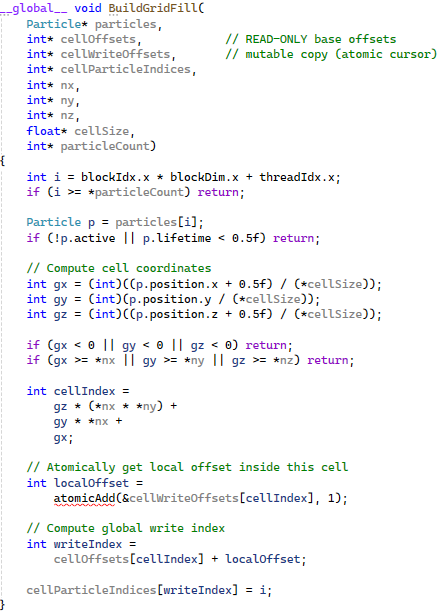

Collisions are then detected by iterating the particles in each cell. Collisions are added to an array of collisions to be resolved.

```CPP
__global__ void DetectCollisionsGPU(
    Particle* particles,
    int* cellOffsets,
    int* nx,
    int* ny,
    int* nz,
	int* cellParticleIndices,
    float* cellSize,
    Collision* collisions,
    int* collisionCount)
{
    int cellIdx =
        blockIdx.x * blockDim.x + threadIdx.x;

    int totalCells =
        (*nx) * (*ny) * (*nz);

    if (cellIdx >= totalCells)
        return;

    const int offsets[3] = { -1, 0, 1 };

    // Convert flat index
    int z = cellIdx / ((*nx) * (*ny));
    int rem = cellIdx % ((*nx) * (*ny));
    int y = rem / (*nx);
    int x = rem % (*nx);

    // Get particle range for this cell
    int start = cellOffsets[cellIdx];
    int end = (cellIdx == totalCells - 1) ? start : cellOffsets[cellIdx + 1];

    for (int i = start; i < end; i++)
    {
        int pIndex = cellParticleIndices[i];

        for (int dx : offsets)
            for (int dy : offsets)
                for (int dz : offsets)
                {
                    int nxCell = x + dx;
                    int nyCell = y + dy;
                    int nzCell = z + dz;

                    // Bounds check
                    if (nxCell < 0 || nyCell < 0 || nzCell < 0)
                        continue;

                    if (nxCell >= *nx ||
                        nyCell >= *ny ||
                        nzCell >= *nz)
                        continue;

                    int neighborIdx =
                        nzCell * ((*nx) * (*ny)) +
                        nyCell * (*nx) +
                        nxCell;

                    int neighborStart = cellOffsets[neighborIdx];
                    int neighborEnd = (neighborIdx == totalCells - 1) ? neighborStart : cellOffsets[neighborIdx + 1];

                    for (int j = neighborStart;
                        j < neighborEnd;
                        j++)
                    {
                        if (i == j) continue;
                        int qIndex =
                            cellParticleIndices[j];

                        // Avoid duplicate pairs
                        if (pIndex >= qIndex)
                            continue;

                        if (!particles[pIndex].active ||
                            !particles[qIndex].active)
                            continue;

                        // Compute distance
                        float dx = particles[pIndex].position.x -
                            particles[qIndex].position.x;

                        float dy = particles[pIndex].position.y -
                            particles[qIndex].position.y;

                        float dz = particles[pIndex].position.z -
                            particles[qIndex].position.z;

                        float dist2 =
                            dx * dx + dy * dy + dz * dz;

                        const float radius = 0.01f;
                        const float collisionDistance =
                            radius * 2.0f;

                        if (dist2 <
                            collisionDistance *
                            collisionDistance)
                        {
                            int outIndex =
                                atomicAdd(collisionCount, 1);

                            if (outIndex >= MAX_PARTICLES_PER_CELL)
                                return;

                            collisions[outIndex] =
                            { pIndex, qIndex };
                        }
                    }
                }
    }
}
```

Collisions are then resolved.

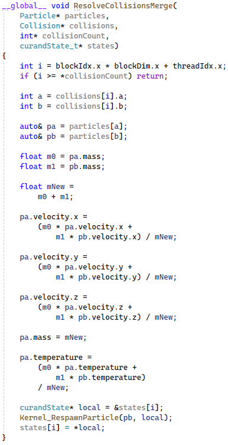

### Rendering

OpenGL is used to create and draw to a window, with the `cuda_gl_interop` passing particles to OpenGL to draw.

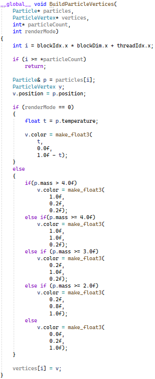

### Synchronization

Each function is called from a `launch` function which handles launching, synchronization, and error handling.

Example:

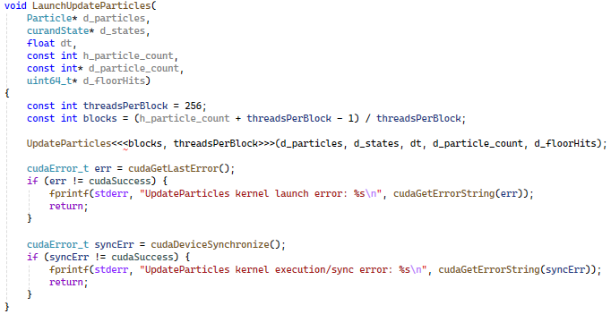

## CPU Design

Particles are initially spawned but are `inactive` such that they are ignored by all processes until made `active` by a respawn function. This prevents initial spikes in collisions when the program starts, allowing particles to increase in number and hold a steadier flow with more particles.

### Control Loop

Once relevant objects are created and data structures are populated, a thread is spawned which loops and adds threads to thread pools for physics, cooling, and spatial grid creation. This also uses channels to send the grid, receive the result of collisions, and send particles to be drawn.

```Rust
std::thread::spawn(move || {
        let mut last = std::time::Instant::now();

        let mut emitter = Emitter {
            spawn_rate: 12000.0,
            accumulator: 0.0,
        };

        // Build initial grid for the first loop.
        build_grid(&mut grid, &particles.lock().unwrap(), &bounds);

        loop {
            let now = std::time::Instant::now();
            let dt = (now - last).as_secs_f32();
            last = now;

            let mut particles_guard = particles.lock().unwrap();
            //println!("Live: {}", particles_guard.live_particles());
            //println!("Dead: {}", particles_guard.dead_particles());
            emitter.accumulator += emitter.spawn_rate * dt;
            let mut to_spawn = emitter.accumulator.floor() as usize;
            emitter.accumulator -= to_spawn as f32;

            let available = particles_guard.dead_particles() as usize;
            if to_spawn > available {
                to_spawn = available;
            }

            if to_spawn > 0 {
                particles_guard.spawn_some(to_spawn, &circle);
            }
            drop(particles_guard);

            let particles_arc = Arc::clone(&particles);
            physics_pool.install(|| {
                let mut particles_guard = particles_arc.lock().unwrap();
                physics_step(&mut *particles_guard, dt, &circle, Arc::clone(&thread_collision), &bounds, &mut grid)
            });

            let particles_guard = particles.lock().unwrap();
            build_grid(&mut grid, &*particles_guard, &bounds);

            let snapshot = Arc::new(CollisionSnapshot::new(&*particles_guard, &grid));
            drop(particles_guard);

            let total_cells = grid.cells.len();
            let mid_cell = total_cells / 2;
            collision_job_tx.send((Arc::clone(&snapshot), 0, mid_cell)).unwrap();
            collision_job_tx.send((Arc::clone(&snapshot), mid_cell, total_cells)).unwrap();

            let particles_arc = Arc::clone(&particles);
            cooling_pool.install(move || {
                let mut particles_guard = particles_arc.lock().unwrap();
                cooling_step(&mut *particles_guard, dt)
            });

            let mut collisions = collision_result_rx.recv().unwrap();
            collisions.extend(collision_result_rx.recv().unwrap());

            merge_job_tx.send(collisions).unwrap();
            merge_done_rx.recv().unwrap();

            let particles_guard = particles.lock().unwrap();
            let mut buffer: Vec<vertex::Vertex> = Vec::new();
            particles_guard.write_positions_sampled(&mut buffer, 32);
            //println!("{}", buffer.iter().count());
            tx.send(buffer).ok();
        }
    });
```

### Physics Update

This chunks the `Particle` vector, iterating and updating each particle without needing to lock anything as each particle can only be accessed by one thread at a time.

The atomic floor counter allows the value to be updated by any thread at any time without needing to be locked. This is an `arc` to allow multiple ownership between threads.

This also includes drag calculations as a novel feature. There is also an additional drag view to acompany the temperature and mass views.

```Rust
pub fn physics_step(p: &mut Particles, dt: f32, circle: &[f32; 2], floor_counter: Arc<AtomicU64>, bounds: &Bounds, grid: &mut SpatialGrid) {
    let g = -9.81;

    // Process particles in parallel chunks
    p.particles
        .par_chunks_mut(256)
        .for_each(|chunk| {
            for particle in chunk.iter_mut() {
                if !particle.alive { continue; }

                //particle.time += dt;

                // update velocity (gravity)
                particle.velocity[1] += g * dt;

                // apply linear drag: a_drag = -DRAG_K * v / mass
                let vx = particle.velocity[0];
                let vy = particle.velocity[1];
                let vz = particle.velocity[2];
                let speed = (vx*vx + vy*vy + vz*vz).sqrt();

                if speed > 0.0 {
                    let drag_acc_factor = DRAG_K / particle.mass;
                    particle.velocity[0] += -drag_acc_factor * vx * dt;
                    particle.velocity[1] += -drag_acc_factor * vy * dt;
                    particle.velocity[2] += -drag_acc_factor * vz * dt;

                    // store a normalized drag value for rendering (clamped 0..1)
                    let drag_val = (drag_acc_factor * speed).abs();
                    particle.drag = drag_val.min(1.0);
                } else {
                    particle.drag = 0.0;
                }

                // update position
                particle.position[0] += particle.velocity[0] * dt;
                particle.position[1] += particle.velocity[1] * dt;
                particle.position[2] += particle.velocity[2] * dt;

                // floor collision
                if particle.position[1] <= bounds.min_y {
                    respawn_particle(particle, circle);
                    floor_counter.fetch_add(1, Ordering::Relaxed);
                    //particle.alive = false;
                    continue;
                }

                // boundary reflections - check position, not velocity
                if particle.position[0] <= bounds.min_x || particle.position[0] >= bounds.max_x {
                    particle.velocity[0] *= -1.0;
                }

                if particle.position[2] <= bounds.min_z || particle.position[2] >= bounds.max_z{
                    particle.velocity[2] *= -1.0;
                }
            }
        });
}
```

### Spatial Grid

Allows collision detection by inserting particles to relevant cells and checking if particles in a given cell collide with each other, or the neighbouring cells.

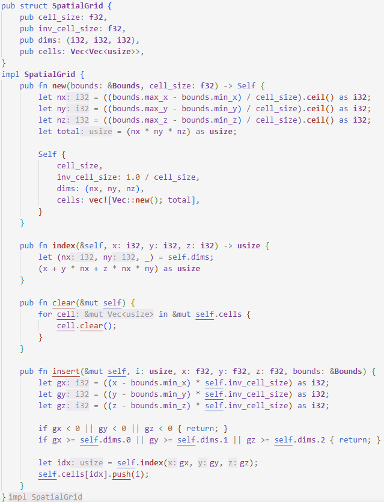

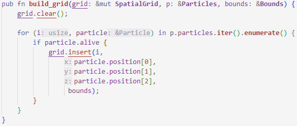

### Collision Detection

Collision detection and handling are split into two, using channels to send detected collisions to the handler which sends the result of merges back to the controller.

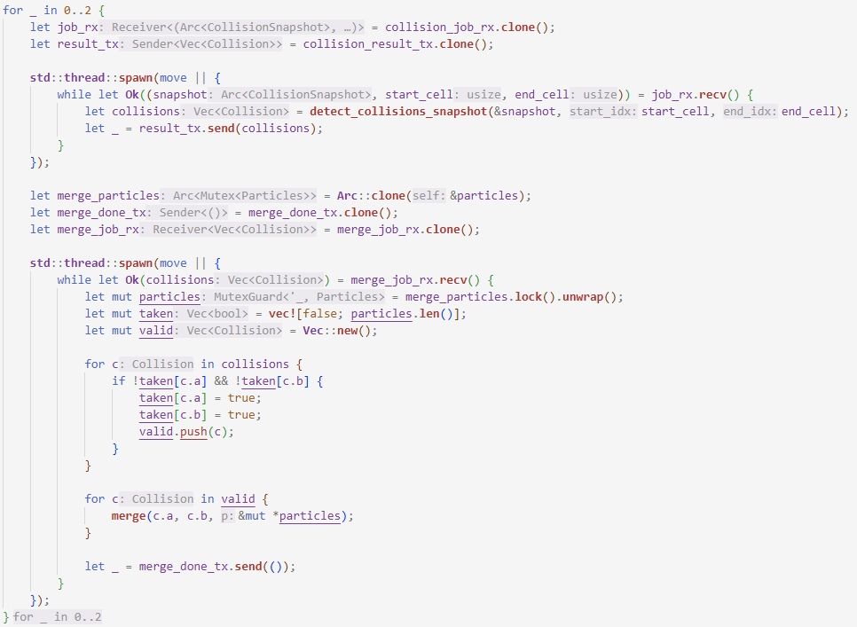

Detection is performed by iterating cells and the particles within them.

```Rust
pub fn detect_collisions_snapshot(snapshot: &CollisionSnapshot, start_idx: usize, end_idx: usize) -> Vec<Collision> {
    let offsets = [-1, 0, 1];
    let (nx, ny, nz) = snapshot.grid.dims;
    let mut collisions = Vec::new();

    for cell_idx in start_idx..end_idx {
        let indices = &snapshot.grid.cells[cell_idx];
        let z = cell_idx as i32 / (nx * ny);
        let rem = cell_idx as i32 % (nx * ny);
        let y = rem / nx;
        let x = rem % nx;

        for &i in indices {
            for dx in &offsets {
                for dy in &offsets {
                    for dz in &offsets {
                        let nx_ = x + dx;
                        let ny_ = y + dy;
                        let nz_ = z + dz;

                        if nx_ < 0 || ny_ < 0 || nz_ < 0 { continue; }
                        if nx_ >= nx || ny_ >= ny || nz_ >= nz { continue; }

                        let neighbor_idx = snapshot.grid.index(nx_, ny_, nz_);

                        for &j in &snapshot.grid.cells[neighbor_idx] {
                            if i >= j { continue; }
                            if !snapshot.alive[i] || !snapshot.alive[j] { continue; }

                            let dx = snapshot.positions[i][0] - snapshot.positions[j][0];
                            let dy = snapshot.positions[i][1] - snapshot.positions[j][1];
                            let dz = snapshot.positions[i][2] - snapshot.positions[j][2];

                            let dist2 = dx*dx + dy*dy + dz*dz;
                            let radius = 0.01;
                            if dist2 < (radius * 2.0) * (radius * 2.0) {
                                if collisions.iter().count() < MAX_COLLISIONS{
                                    collisions.push(Collision { a: i, b: j });
                                }
                            }
                        }
                    }
                }
            }
        }
    }

    collisions
}
```

### Collision Handling

Detected collisions are sent to the handler thread via a channel and handled by a merge function.

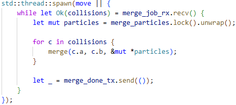

The second particle `b` of a merge is made `inactive` or "killed" to be respawned.

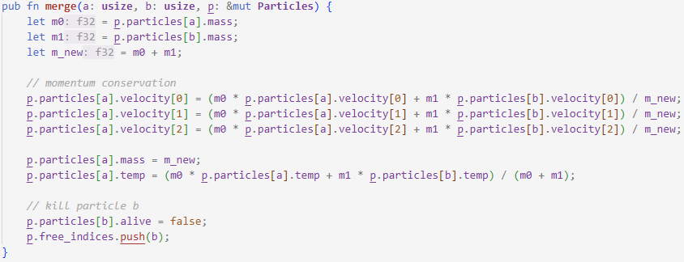

### Cooling

Cooling is added to a thread pool. This is separate to the `physics_step` to more closely follow the assignment brief.

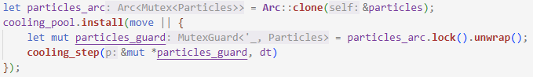

This uses `par_iter_mut` for mutabale 'parallel' iteration.

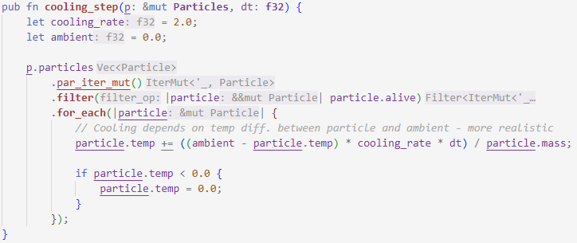

### Rendering

A sample of particle positions are written to a buffer and sent to the render loop via a channel.

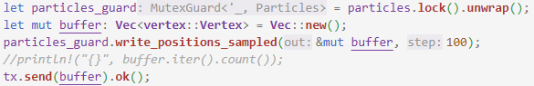

## Performance

Temporary code has been added to each render loop to determine how long each frame takes to complete. 

For fair comparison, both systems were set to use 50,000 particles and run in release mode without debugging for execution timing.

Rendering/drawing is included in the times to time the whole frame.

Each implementation will be run for around 10 seconds with the output from the last ten frames being taken to calculate an average.

These tests were performed on my personal computer with an Intel I7-12650H and Nvidia RTX 3060. This is less powerful than the fenner machines which can run this code quicker.

### Rust Execution Times

`let time = Instant::now();` was added to the start of the render loop, with `let duration = time.elapsed(); println!("Elapsed time: {:.2?}", duration);` at the end.

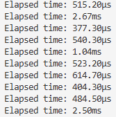

Total: 9669.5us

Average: 966.95us

Max stable particles: 110,000

As the `Install` function of `ThreadPool` is used, threads are spawned automatically when enough work exists. Increasing partition/chunk sizes reduces the number of threads spawned while increasing work/load for each thread, causing each thread to take longer to complete. Reducing this size has the opposite effect and potentially cause extra overhead for spawning and scheduling to outweigh time reduction.

### CUDA Execution Times

`std::chrono::high_resolution_clock` was used to time this implementation, with `auto start = std::chrono::high_resolution_clock::now();` being added to the start of the render loop, and the output at the end (after rendering/drawing):

```C++
auto end = std::chrono::high_resolution_clock::now();
auto duration_us = std::chrono::duration_cast<std::chrono::microseconds>(end - start).count();
std::cout << "Execution Time: " << duration_us << " µs\n";
```

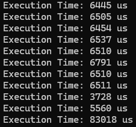

The final frame/output shall be considered an outlier for this as it is over ten times longer than all other outputs, as the simulation stutters momentarily when the close button is hovered over.

Total: 61,551us

Average: 6,155.1us

Max stable particles: 265,000

This uses blocks of 256 threads (8 warps per block). The GPU schedules warps not blocks, smaller blocks have lower latency and poorer latency hiding, while bigger blocks reduces the number of blocks and can reduce ocupancy.
256 threads is a middle ground as smaller blocks require more registers, and larger blocks may face contention with the `atomicAdd` calls. 

### Comparison

The CUDA implementation takes around six times longer to execute per frame due to having to launch and synchronize multiple GPU kernels. However, CUDA can also handle a larger simulation with more particles due to the GPU handling all particles and collisions at roughly the same time as each particle is handled by its own thread for physics, and cooling.

Technically, not all particles are handled at the exact same time as the GPUs in the Fenner machines (RTX 3070s) have 46 Steaming Multiprocessors with 2048 threads each (2 blocks of 32 warps) for a total of 94,208 resident threads. As each particle is handled by one thread each, the particle array is automatically chunked CUDA with the functions being run on each chunk. 

## Reflection

The Rust implementation went through several initial designs to find a good architecture, including an implementation which solely used channels to send and receive particles through a pipeline of functions for each step of the simulation. These faced many issues with bottlenecking and scalability, leading to the use of thread pools.

The Rust simulation also experiences "banding" towards the top of the shower where particles aren't evenly distributed. I believe this is due to inactive particles being respawned at once and moved at the same time with similar velocities.

The CUDA implementation turned out to be simpler, following a process of creating an initial CPU simulation which was migrated to CUDA functions with relevant synchronises.

Each function is its own kernel with `cudaDeviceSynchronise` used as this ensures the entire grid completes before continuing. `__syncthreads()` on the deivce only synchronises threads within a block and causes race conditions. `cooperative_groups` were attempted but issues were faced with the grid size when scaling. 

### Future Optimisations

Using a mixture of shared and global memory in CUDA could reduce memory access times for certain kernels such as collision detection due to the high number of memory reads on different values.

Certain kernels could also be merged into a single function, such as collision detection automatically handling collisions instead of passing them to another kernel.